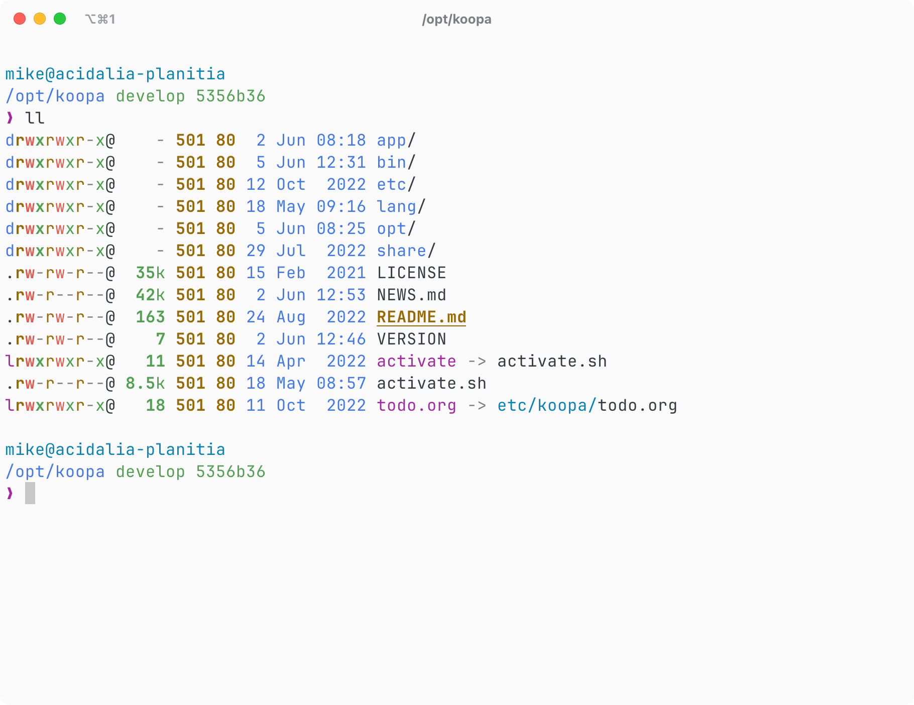

# koopa

<p>
<picture>
<source srcset="_static/screenshot-dark.png" media="(prefers-color-scheme: dark)" />

</picture>
</p>

Source code is available on [GitHub](https://github.com/acidgenomics/koopa).

```sh
sh -c "$(curl -LSs https://koopa.acidgenomics.com/install)"
```

See [Installation](installation.md) for the full install flow, or jump straight to
the [CLI reference](reference/index.md) for every `koopa` command.

```{toctree}
:maxdepth: 1
:caption: Guide

installation
applications
activation
dotfiles
troubleshooting
```

```{toctree}
:maxdepth: 1
:caption: Reference

reference/index
```
